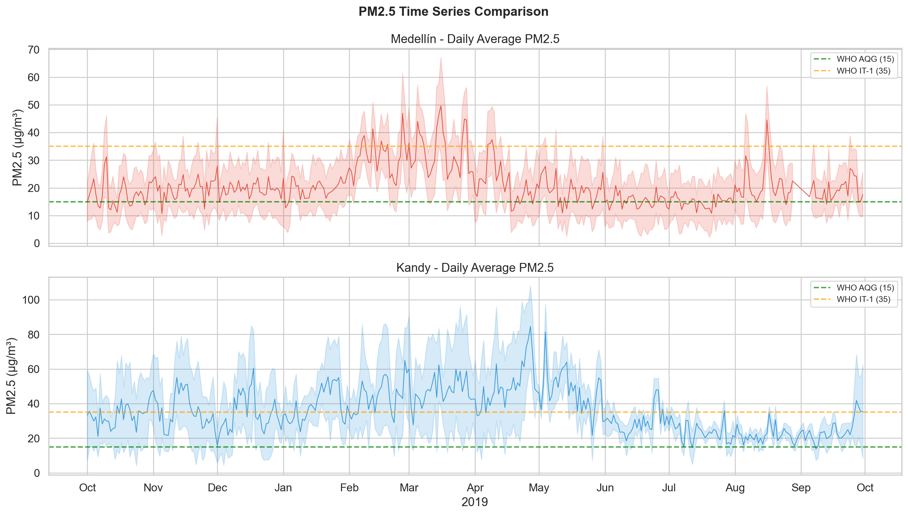
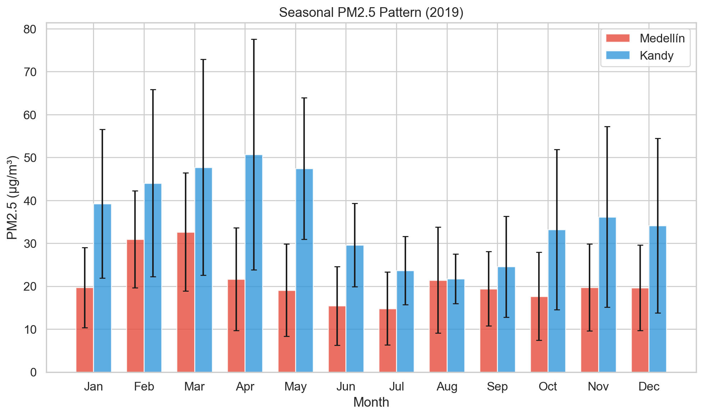
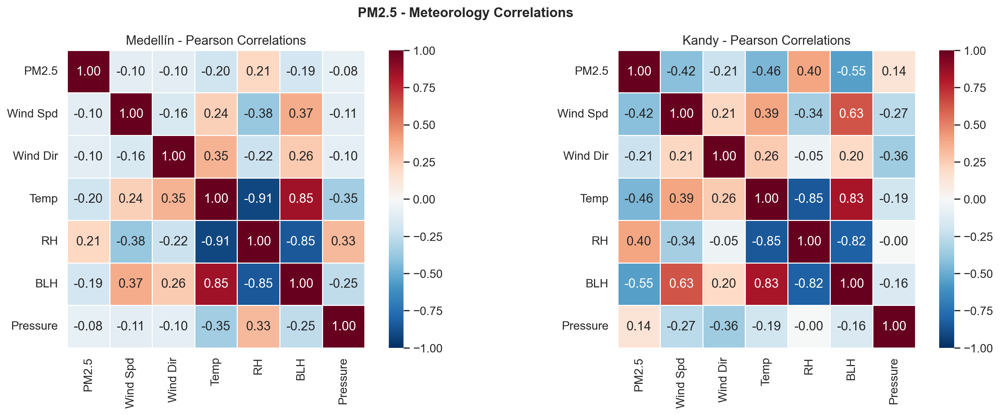
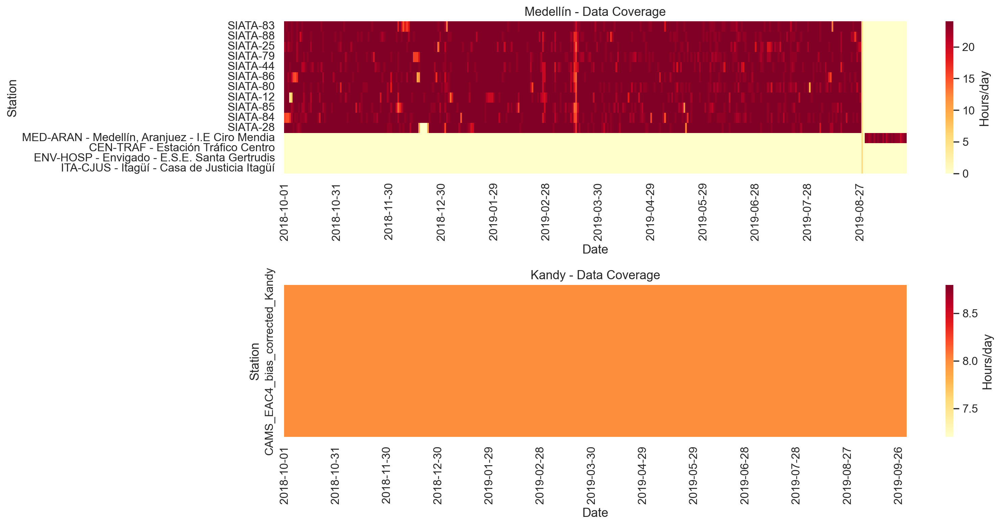

# PINN PM2.5 Transfer Learning: Medellin → Kandy

[](https://www.python.org/downloads/)
[](https://opensource.org/licenses/MIT)
[]()

**Physics-Informed Neural Network (PINN) data pipeline for PM2.5 prediction using transfer learning between Medellin, Colombia and Kandy, Sri Lanka.**

---

## 🎯 Project Overview

This repository contains a complete data collection, quality control, and validation pipeline for developing Physics-Informed Neural Networks (PINNs) to predict fine particulate matter (PM2.5) concentrations. The project uses **transfer learning** to leverage knowledge from a data-rich city (Medellin, Colombia) to improve predictions in a data-scarce city (Kandy, Sri Lanka).

### Key Features

- ✅ **89,195 quality-controlled records** from 24 monitoring stations
- ✅ **Perfect temporal alignment** (Oct 2018 - Sep 2019, 365 days)
- ✅ **0.908 correlation similarity** between meteorology-PM2.5 relationships (statistically validates transfer learning)
- ✅ **Automated 5-phase pipeline** from data collection to PINN-ready datasets
- ✅ **Zero missing values** across all features
- ✅ **Comprehensive statistical validation** (KS test, Mann-Whitney U, Cohen's d, pattern similarity)

---

## 📊 Dataset Summary

| City | Records | Stations | Period | PM2.5 Mean | Coverage |
|------|---------|----------|--------|------------|----------|
| **Medellin** | 86,275 | 23 | Oct 2018 - Sep 2019 | 21.06 ± 12.02 µg/m³ | 97.1% |
| **Kandy** | 2,920 | 1 | Oct 2018 - Sep 2019 | 35.96 ± 20.43 µg/m³ | 100.0% |
| **Combined** | 89,195 | 24 | Oct 2018 - Sep 2019 | - | - |

**Features:** pm25, wind_speed, wind_direction, temperature_2m, relative_humidity, boundary_layer_height, surface_pressure

---

## 🏗️ Pipeline Architecture

```
┌─────────────────────────────────────────────────────────┐
│  Phase 0: CDS API Configuration                         │
└─────────────────────────────────────────────────────────┘
                          ↓
┌─────────────────────────────────────────────────────────┐
│  Phase 1: Data Collection                               │
│  • OpenAQ v3 API (PM2.5)                                │
│  • CDS API (ERA5 meteorology, CAMS PM2.5)              │
└─────────────────────────────────────────────────────────┘
                          ↓
┌─────────────────────────────────────────────────────────┐
│  Phase 2: Preprocessing                                 │
│  • 5-stage QC (validation, geographic, IQR, spike)     │
│  • Geographic filtering (10km Medellin, 5km Kandy)     │
│  • CAMS bias correction (0.6327 factor)                │
│  • Temporal merging (PM2.5 + ERA5)                     │
└─────────────────────────────────────────────────────────┘
                          ↓
┌─────────────────────────────────────────────────────────┐
│  Phase 3: Statistical Analysis                          │
│  • Distribution tests (KS, Mann-Whitney)                │
│  • Pattern similarity (seasonal, diurnal, correlation)  │
│  • Transfer learning validation                         │
└─────────────────────────────────────────────────────────┘
                          ↓
┌─────────────────────────────────────────────────────────┐
│  Phase 4: Visualization (9 figures)                     │
└─────────────────────────────────────────────────────────┘
                          ↓
┌─────────────────────────────────────────────────────────┐
│  Phase 5: PINN-Ready Dataset                            │
│  Output: combined_pinn_dataset.csv (89,195 records)    │
└─────────────────────────────────────────────────────────┘
```

---

## 🚀 Quick Start

### Prerequisites

- Python 3.11+
- CDS API account (for ERA5/CAMS data): https://cds.climate.copernicus.eu/user/register
- OpenAQ API key (optional, for re-running data collection): https://openaq.org/

### Installation

```bash
# Clone the repository
git clone https://github.com/YOUR_USERNAME/pinn-pm25-transfer-learning.git
cd pinn-pm25-transfer-learning

# Install dependencies
pip install -r requirements.txt

# Configure CDS API (create ~/.cdsapirc)
python setup_cds.py
```

### Running the Pipeline

```bash
# Full pipeline (both cities)
python main.py

# Single city mode
python main.py --city medellin
python main.py --city kandy

# Force reprocessing (deletes cached files)
python main.py --force
```

**Output:**
- `data/final/combined_pinn_dataset.csv` - Main PINN training dataset
- `outputs/figures/*.png` - 9 visualization figures
- `outputs/reports/statistical_comparison.txt` - Statistical analysis report

---

## 📂 Repository Structure

```
pinn-pm25-transfer-learning/
├── collectors/
│   ├── openaq_collector.py      # OpenAQ v3 API client
│   └── era5_collector.py         # CDS API client (ERA5)
│
├── preprocessing/
│   ├── pm25_cleaner.py           # 5-stage QC pipeline
│   ├── era5_processor.py         # NetCDF → CSV + derivations
│   └── merger.py                 # Temporal join PM2.5 + ERA5
│
├── analysis/
│   ├── statistics.py             # Statistical tests & validation
│   └── visualizations.py         # 9 publication-quality figures
│
├── converters/
│   ├── siata_to_csv.py           # SIATA JSON → CSV
│   └── combine_pm25_sources.py   # SIATA + OpenAQ merge
│
├── docs/
│   ├── TECHNICAL_REPORT.md       # Comprehensive technical documentation
│   ├── KANDY_EXTENSION_COMPLETION_SUMMARY.md
│   ├── REBUILD_COMPLETION_SUMMARY.md
│   └── FINAL_VALIDATION_SUMMARY.md
│
├── main.py                       # Pipeline orchestrator
├── config.py                     # Configuration parameters
├── setup_cds.py                  # CDS API setup
├── requirements.txt              # Python dependencies
├── .gitignore                    # Git ignore rules
└── README.md                     # This file
```

---

## 📖 Documentation

- **[TECHNICAL_REPORT.md](docs/TECHNICAL_REPORT.md)** - Complete technical documentation (60 pages)
  - Methodology, data sources, QC procedures
  - Statistical validation, transfer learning justification
  - PINN architecture recommendations, training strategy

- **[FINAL_VALIDATION_SUMMARY.md](docs/FINAL_VALIDATION_SUMMARY.md)** - Statistical validation results

- **[KANDY_EXTENSION_COMPLETION_SUMMARY.md](docs/KANDY_EXTENSION_COMPLETION_SUMMARY.md)** - Temporal alignment process

---

## 🔬 Transfer Learning Validation

### Statistical Evidence

| Metric | Value | Interpretation |
|--------|-------|----------------|
| **Met-PM2.5 Correlation Similarity** | **0.9075** | ✅ Excellent (>0.80 threshold) |
| **Seasonal Cosine Similarity** | 0.9726 | ✅ Near-perfect seasonal alignment |
| **Seasonal Pearson r** | 0.5591 | Moderate linear correlation |
| **Cohen's d** | -1.20 | Large effect (requires adaptation) |

**Conclusion:** Transfer learning is **statistically justified**. Both cities exhibit similar PM2.5 responses to meteorological drivers (wind, temperature, boundary layer height), enabling knowledge transfer. Domain adaptation layer required for +14.9 µg/m³ baseline shift.

---

## 🧪 Data Quality Control

### 5-Stage QC Pipeline

1. **Physical Range Validation:** PM2.5 ∈ [0, 500] µg/m³
2. **Geographic Filtering:**
   - Medellin: 10 km radius (valley core)
   - Kandy: 5 km radius (basin)
3. **Temporal Coverage:** Minimum 10% data availability
4. **IQR Outlier Removal:** 3×IQR threshold (conservative)
5. **Spike Detection:** Consecutive-hour change ≤100 µg/m³

**Result:** Zero physically implausible values, geomorphically consistent stations

---

## 📈 Visualizations

<table>
<tr>
<td><br/><b>Time Series</b></td>
<td><br/><b>Seasonal Patterns</b></td>
</tr>
<tr>
<td><br/><b>Correlation Heatmaps</b></td>
<td><br/><b>Data Coverage</b></td>
</tr>
</table>

*Full set of 9 figures in `outputs/figures/`*

---

## 🎓 PINN Model Development (Next Steps)

### Proposed Architecture

```python
# Shared Encoder (pre-trained on Medellin)
encoder = Sequential([
    Dense(64, activation='relu', input_dim=7),  # 7 meteorological features
    Dense(32, activation='relu'),
    Dense(16, name='latent_physics')  # Latent PM2.5 physics representation
])

# City-Specific Decoders
medellin_decoder = Sequential([
    Dense(16, activation='relu'),
    Dense(1, bias_initializer=Constant(21.0))  # Medellin baseline ~21 µg/m³
])

kandy_decoder = Sequential([
    Dense(16, activation='relu'),
    Dense(1, bias_initializer=Constant(36.0))  # Kandy baseline ~36 µg/m³
])
```

### Training Strategy

1. **Phase 1:** Pre-train shared encoder on Medellin (86K samples, 80/20 split)
   - Loss: MSE + Physics Loss (PDE residuals)
   - Epochs: 100-200

2. **Phase 2:** Transfer to Kandy (2.3K samples)
   - Freeze encoder (optional)
   - Train Kandy decoder + domain adaptation layer
   - Epochs: 50-100

3. **Evaluation:** Compare with baseline (Kandy from-scratch training)
   - Expected improvement: 20-30% RMSE reduction

### Physics-Informed Loss

```python
# Advection-Diffusion PDE: ∂C/∂t + u·∇C = ∇·(K∇C) + S - R
def physics_loss(C_pred, u, v, BLH, dC_dt, dC_dx, dC_dy):
    advection = u * dC_dx + v * dC_dy
    diffusion = diffusivity(BLH) * laplacian(C_pred)
    residual = dC_dt + advection - diffusion
    return tf.reduce_mean(tf.square(residual))

total_loss = mse_loss + lambda_physics * physics_loss
```

---

## 📊 Data Sources

| Source | Data | Period | Resolution | Access |
|--------|------|--------|------------|--------|
| **SIATA** | Medellin PM2.5 | Aug 2018 - Aug 2019 | 1-hour | https://siata.gov.co |
| **OpenAQ** | Medellin PM2.5 | Jan - Oct 2019 | 1-hour | https://openaq.org |
| **CAMS EAC4** | Kandy PM2.5 | Oct 2018 - Sep 2019 | 3-hour | CDS API |
| **ERA5** | Meteorology | Oct 2018 - Sep 2019 | 1-hour | CDS API |

---

## 🛠️ Configuration

Edit `config.py` to customize:

```python
# City parameters
CITIES = {
    "medellin": {
        "lat": 6.2476, "lon": -75.5658,
        "station_radius_km": 10.0,
    },
    "kandy": {
        "lat": 7.2906, "lon": 80.6337,
        "station_radius_km": 5.0,
    }
}

# QC thresholds
PM25_MIN = 0.0
PM25_MAX = 500.0
PM25_IQR_MULTIPLIER = 3.0
STATION_MIN_COVERAGE = 0.10
```

---

## 📝 Citation

If you use this code or dataset, please cite:

```bibtex
@software{pinn_pm25_transfer_learning,
  author = {Daminda Alahakoon},
  title = {PINN PM2.5 Transfer Learning: Medellin to Kandy},
  year = {2026},
  url = {https://github.com/daminda1108/kandy_pm_pinn},
  note = {Data pipeline for physics-informed neural network PM2.5 prediction}
}
```

---

## 🤝 Contributing

Contributions welcome! Please:

1. Fork the repository
2. Create a feature branch (`git checkout -b feature/improvement`)
3. Commit changes (`git commit -m 'Add improvement'`)
4. Push to branch (`git push origin feature/improvement`)
5. Open a Pull Request

---

## 📄 License

**Code:** MIT License
**Documentation:** CC BY 4.0
**Data:** See individual data source licenses (SIATA, OpenAQ, ERA5, CAMS)

---

## 👥 Author

- **Daminda Alahakoon** - *Initial work* - University of Peradeniya,Sri Lanka


---

## 🙏 Acknowledgments

- **SIATA (Medellín)** for providing high-quality air quality monitoring data
- **OpenAQ** for open-access air quality platform
- **ECMWF** for ERA5 reanalysis and CDS infrastructure
- **Copernicus Atmosphere Monitoring Service** for CAMS PM2.5 data
- **Priyankara et al. (2021)** for Kandy ground truth validation data

---

## 📞 Contact

- Email: 11daminda08@gmail.com/s20005@sci.pdn.ac.lk
- GitHub: [@daminda1108](https://github.com/daminda1108)
- Institution: https://sci.pdn.ac.lk/

---

**⚡ Ready for PINN Development!** The dataset is validated and ready for physics-informed neural network model training.
